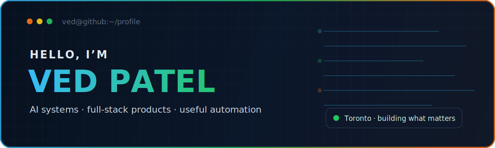
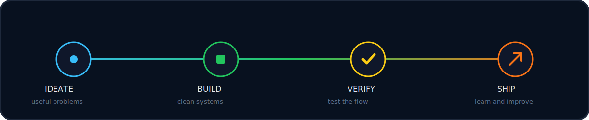
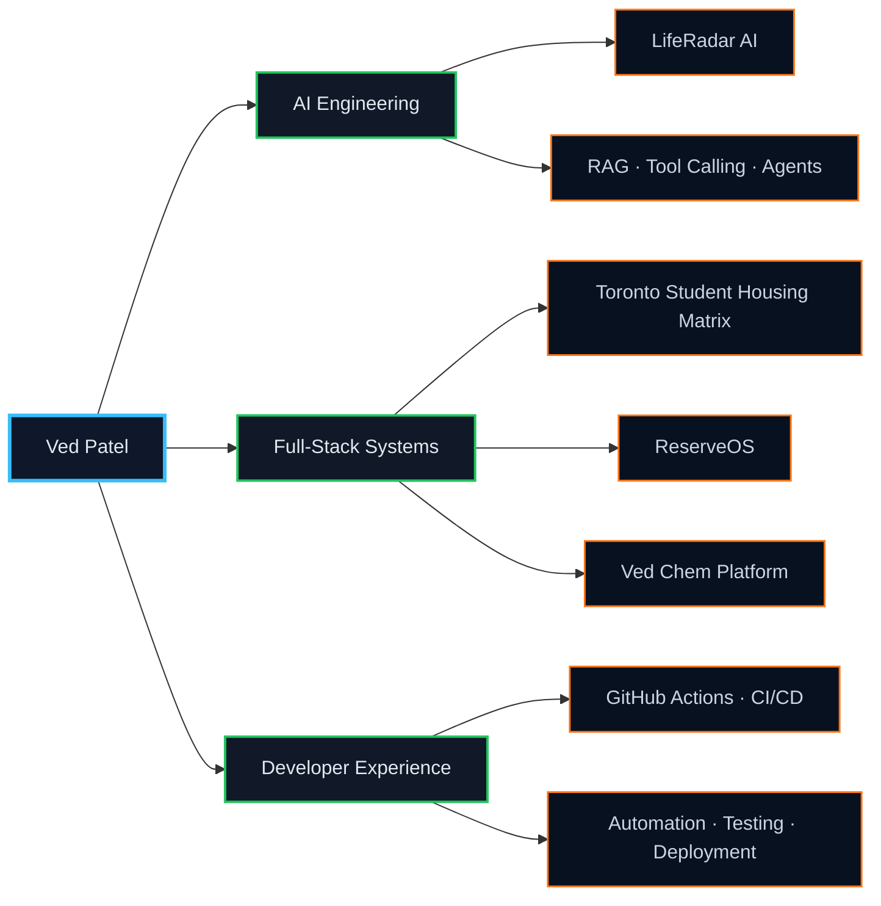

<div align="center">
  
</div>

<br/>

<div align="center">

[](https://git.io/typing-svg)

</div>

<br/>

<table>
<tr>
<td width="50%" valign="top">

```ts
// identity.ts

const ved = {
  location: "Toronto, Canada",
  education: "Computer Engineering",
  focus: [
    "AI engineering",
    "full-stack product development",
    "developer tools and automation",
  ],
  status: "Building, learning, shipping",
};
```

</td>
<td width="50%" valign="top">

```ts
// engineering-principles.ts

const principles = [
  "Solve a real problem first",
  "Keep the interface simple",
  "Design the data model carefully",
  "Verify the complete user flow",
  "Ship, measure, and improve",
];
```

</td>
</tr>
</table>

<div align="center">

### Core stack


<br/><br/>


<br/><br/>


</div>

<br/>

<div align="center">
  
</div>

<br/>

## Featured systems

<table>
<tr>
<td width="50%" valign="top">

### 🏙️ [Toronto Student Housing Matrix](https://github.com/vspatel23/Toronto-student-housing-matrix)

A decision-support platform that helps Toronto students compare housing using rent, commute, safety, amenities, saved preferences, mapping, and value-based ranking.

**Stack:** `React` `Vite` `Node.js` `Express` `MongoDB` `Mongoose` `JWT` `GitHub Actions` `Vercel`

</td>
<td width="50%" valign="top">

### 🍽️ [ReserveOS](https://github.com/patelved3313/restaurant-reservation-system)

An AI-ready restaurant reservation system with secure owner/admin access, multi-location management, business-hour validation, reservation operations, and a voice reservation API.

**Stack:** `Next.js` `TypeScript` `Supabase Auth` `PostgreSQL` `Prisma` `Tailwind`

</td>
</tr>
<tr>
<td width="50%" valign="top">

### 📡 [LifeRadar AI](https://github.com/patelved3313/liferadar-ai)

A privacy-conscious life-admin copilot for tracking bills, subscriptions, upcoming expenses, expiring documents, and important deadlines without connecting users' bank accounts.

**Stack:** `Next.js` `TypeScript` `Firebase Auth` `Firestore` `Tailwind` `Vercel`

</td>
<td width="50%" valign="top">

### 🧪 [Ved Chem Digital Platform](https://github.com/patelved3313/vedchem-redesign)

A premium industrial website for a chemical manufacturer with structured product discovery, product detail pages, RFQ flows, WhatsApp contact, multilingual-ready routing, and future database expansion.

**Stack:** `Next.js` `TypeScript` `Tailwind` `Prisma` `API Routes`

</td>
</tr>
</table>

<br/>

## System map



<br/>

## What I care about

I enjoy building software that removes friction from everyday work. My strongest projects combine a practical product idea with authentication, databases, APIs, clean interfaces, testing, deployment, and AI where it adds real value.

I am currently growing toward software engineering and AI engineering roles where I can work on useful products, reliable systems, and challenging technical problems.

<br/>

## GitHub telemetry

<div align="center">


<br/><br/>


</div>

<br/>

<div align="center">

### Let’s build something useful

[](mailto:patelved3313@gmail.com)
[](https://github.com/patelved3313)

<br/><br/>


&nbsp;

&nbsp;


<br/><br/>

<sub>Designed and built as a living engineering portfolio.</sub>

</div>
