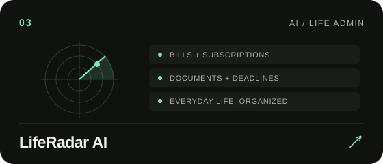
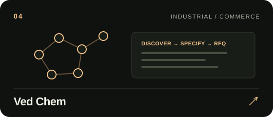
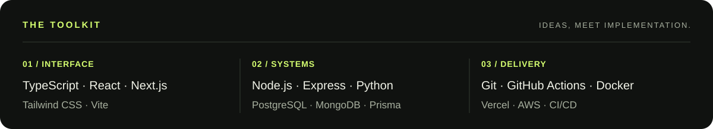

  <picture>
    <source media="(max-width: 600px)" srcset="./assets/hero-mobile.svg" />
    
  </picture>

    

  
 &nbsp; 

  
<a href="#about">About</a> &nbsp; / &nbsp; <a href="#selected-work">Work</a> &nbsp; / &nbsp; <a href="#toolkit">Toolkit</a> &nbsp; / &nbsp; <a href="#github-activity">Activity</a> &nbsp; / &nbsp; <a href="#now">Now</a>

 

## About

I’m **Ved Patel**, a Toronto-based software developer and recent **Seneca Polytechnic graduate** building AI-powered and full-stack products.

I like turning complicated problems into clear, useful software, connecting thoughtful interfaces with the APIs and data models underneath. I care about the details that make a product work well: clear interactions, reliable behavior, and careful execution.

 

## Selected work

Four projects. Different problems. The same care for the details.

<table>
<tr>
<td width="50%" valign="top">

### [Toronto Student Housing Matrix](https://github.com/patelved3313/Toronto-student-housing-matrix)

Compare Toronto student housing by rent, commute, safety, and personal priorities, with maps, saved preferences, rankings, and AI-assisted search.

`React` `Express` `MongoDB` `OpenRouter`

[Live demo](https://torontostudenthousingmatrix.vercel.app)

</td>
<td width="50%" valign="top">

### [ReserveOS](https://github.com/patelved3313/restaurant-reservation-system)

Manage restaurant bookings, locations, and opening hours in one workspace, with role-based access and an API for reservation intake.

`Next.js` `TypeScript` `PostgreSQL` `Prisma` `Supabase`

</td>
</tr>
<tr>
<td width="50%" valign="top">

### [LifeRadar AI](https://github.com/patelved3313/liferadar-ai)

Keep bills, subscriptions, and expiring documents in one place, with upcoming deadlines, spending summaries, and a personal dashboard.

`Next.js` `TypeScript` `Firebase` `Tailwind CSS`

</td>
<td width="50%" valign="top">

### [Ved Chem](https://github.com/patelved3313/vedchem-redesign)

Explore a chemical supplier’s catalog through searchable categories, product details, and direct contact options.

`Next.js` `TypeScript` `Tailwind CSS`

[Live preview](https://vedchem-redesign.vercel.app/en)

</td>
</tr>
</table>

 

## Toolkit

<picture>
  <source media="(max-width: 600px)" srcset="./assets/stack-mobile.svg" />
  
</picture>

**Applied AI** — LLM integrations, structured outputs, and response validation.

 

## GitHub Activity

  
  

 

## Now

<b>Exploring</b> → AI agents, retrieval systems, embeddings, and tool calling. <b>Sharpening</b> → System design, reliability, testing, and product UX. <b>Building</b> → Useful software that holds up beyond the demo.

 

<a href="mailto:patelved3313@gmail.com">
  <picture>
    <source media="(max-width: 600px)" srcset="./assets/footer-mobile.svg" />
    
  </picture>
</a>
