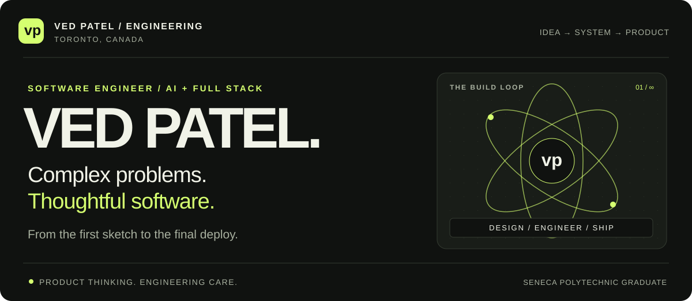
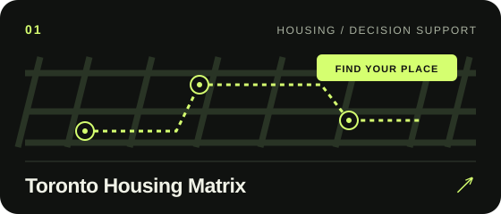
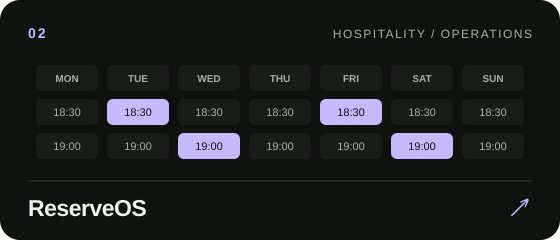

<picture>
  <source media="(max-width: 600px)" srcset="./assets/hero-mobile.svg" />
  
</picture>

**[Explore my work](#selected-work)** &nbsp; · &nbsp; **[Email me](mailto:patelved3313@gmail.com)**

[About](#about) &nbsp; / &nbsp; [Toolkit](#toolkit) &nbsp; / &nbsp; [Now](#now)

## About

I’m **Ved Patel**, a product-minded software engineer in Toronto and a recent **Seneca Polytechnic graduate**. I build AI-powered and full-stack products, from the interface people use to the APIs and data models underneath.

I’m interested in the decisions that make software useful: what to automate, how to model the problem, and what should happen when a request fails. Clear interfaces, validated data, and testable behavior matter to me.

## Selected work

### [Toronto Student Housing Matrix](https://github.com/patelved3313/Toronto-student-housing-matrix)

**Compare the tradeoffs before choosing a place to live.**

A team capstone for comparing Toronto student housing by rent, estimated commute, and personal priorities. Natural-language search turns a housing brief into validated filters; AI comparison explains the shortlisted options.

JWT authentication, saved collections, adjustable scoring, and frontend/backend tests connect the experience to a complete system. GitHub Actions checks both applications. Uses course-project demo data.

`React` `Express` `MongoDB` `OpenRouter`

[Repository](https://github.com/patelved3313/Toronto-student-housing-matrix) &nbsp; · &nbsp; [Live demo](https://torontostudenthousingmatrix.vercel.app)

### [ReserveOS](https://github.com/patelved3313/restaurant-reservation-system)

**A shared reservation book for restaurant teams.**

A restaurant operations MVP with owner/admin access, multiple locations, and reservation management. Supabase sessions and Prisma queries scope access by restaurant; booking requests are checked against location opening hours. A JSON intake API provides an integration point for voice systems.

`Next.js` `TypeScript` `PostgreSQL` `Prisma`

[Repository](https://github.com/patelved3313/restaurant-reservation-system)

### [LifeRadar AI](https://github.com/patelved3313/liferadar-ai)

**Life admin, in one place.** An MVP for manually tracking bills, subscriptions, and expiring documents without bank access. Firebase Auth and Firestore support user-scoped records; the AI assistant currently uses mocked, rule-based responses.

`Next.js` `TypeScript` `Firebase Auth` `Firestore`

### [Ved Chem](https://github.com/patelved3313/vedchem-redesign)

**A clearer path from product discovery to inquiry.** A catalog and product-detail experience with a request-for-quote interface and locale-based routes. The inquiry API is a scaffold; persistence and delivery are future work.

`Next.js` `TypeScript` `Tailwind CSS` &nbsp; · &nbsp; [Live preview](https://vedchem-redesign.vercel.app/en)

## Toolkit

**Interface** — TypeScript, React, Next.js, Tailwind CSS. 
**APIs & data** — Node.js, Express, PostgreSQL, MongoDB, Prisma. 
**Auth & delivery** — Supabase, Firebase, Git, GitHub Actions, Vercel. 
**Applied AI** — LLM integrations, structured outputs, and response validation.

## Now

**Exploring** how retrieval-augmented generation (RAG), embeddings, and tool-calling agents can make product features more useful. 
**Sharpening** system design, failure handling, and the tests that keep an interface and its API in agreement.

 

Open to conversations about software engineering roles and thoughtful product ideas. 
**[patelved3313@gmail.com](mailto:patelved3313@gmail.com)**
